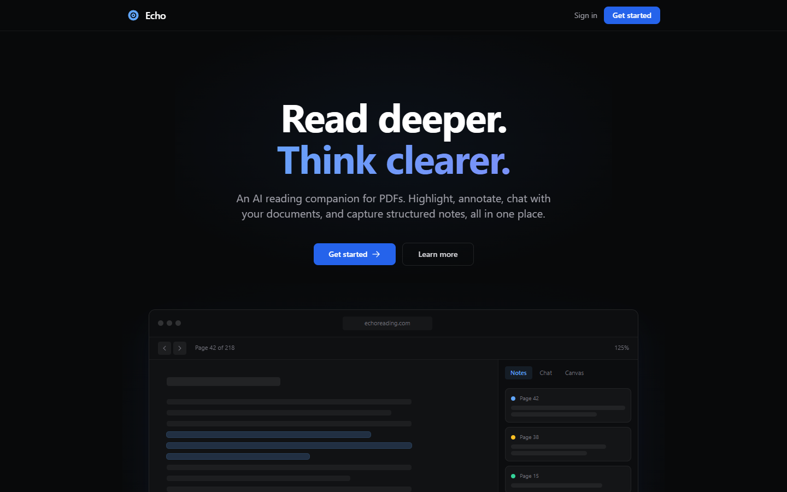
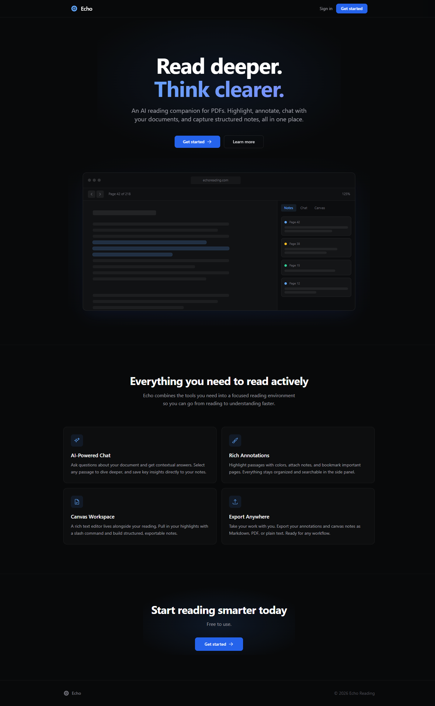

# Echo

**An AI reading companion for PDFs.**

Read, highlight, annotate, chat with your documents, and capture structured notes. All in one place.

**[echoreading.com](https://www.echoreading.com)**



## Features

### PDF Reader
- Full PDF rendering with page navigation, zoom (0.25x to 3x), and fit-to-width
- Text selection with highlighting and dictionary lookup
- Reading progress tracking across sessions
- Keyboard shortcuts for navigation and panel control

### Annotations
- Color-coded highlights with optional notes
- Free-form notes and page bookmarks
- Organized, filterable side panel
- Click any annotation to jump to its page

### AI Chat (Bring Your Own Key)
- Chat about your document using OpenAI or Anthropic models
- Select text and ask questions about specific passages
- Save AI insights directly to your annotations
- Your API key is stored encrypted in the browser and sent only to the provider you choose

### Canvas
- Rich text editor (TipTap) alongside your reading
- `/notes` slash command to pull in highlights and annotations
- Build structured, exportable notes as you read

### Export
- Export annotations and canvas notes as Markdown, PDF, or plain text
- Preview before exporting with stats summary
- Includes document metadata (title, author)

### Library
- Upload and manage your PDF collection
- Auto-generated cover thumbnails from first page
- Reading progress indicators on book cards
- Edit book metadata, drag-and-drop upload

### More
- Dark and light theme with system preference detection
- Dictionary lookup on selected text
- Account management via Clerk
- Cloud persistence via Supabase

## Screenshots

| Landing Page | App Mockup |
|---|---|
|  |  |

## Tech Stack

| Layer | Technology |
|---|---|
| Frontend | React 19, TypeScript, Vite, Tailwind CSS |
| Auth | Clerk |
| Backend | Supabase (PostgreSQL + Storage) |
| Editor | TipTap |
| PDF | react-pdf / pdf.js |
| AI | OpenAI and Anthropic APIs (BYOK) |
| Hosting | Vercel |

## Getting Started

### Prerequisites

- Node.js 18+

### Install and run

```bash
cd app
npm install --legacy-peer-deps
npm run dev
```

The app runs at `http://localhost:5173`.

### Environment variables

Create `app/.env.local`:

```
VITE_CLERK_PUBLISHABLE_KEY=your_clerk_publishable_key
VITE_SUPABASE_URL=your_supabase_project_url
VITE_SUPABASE_ANON_KEY=your_supabase_anon_key
```

### Build

```bash
cd app
npm run build
```

### Tests

```bash
cd app
npm run test:run          # Unit tests
npm run test:e2e          # E2E tests (Playwright)
```

## Documentation

- [SECURITY.md](SECURITY.md) - How API keys and data are handled
- [CHANGELOG.md](CHANGELOG.md) - Release history
- [CONTRIBUTING.md](CONTRIBUTING.md) - How to contribute
- [CODE_OF_CONDUCT.md](CODE_OF_CONDUCT.md) - Community standards

## About

A personal project by [Tibi Iorga](https://tibinotes.substack.com). Built by iterating with AI.

## License

MIT. See [LICENSE](LICENSE).
